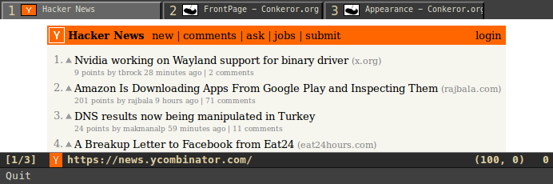
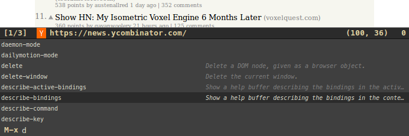

conkeror-theme-zenburn
======================
Zenburn theme for conkeror

## Load theme ##

```
theme_load_paths.unshift("~/.conkeror/themes/");
theme_unload("default");
theme_load("conkeror-theme-zenburn");
```

See: [Conkeror-Appearance](http://conkeror.org/Appearance#Theming)

## Screenshots ##

### conkeror + new-tabs ###



### prompt/completions ###



### Credit

Credit to [zenburn-conkeror](https://github.com/smabie/zenburn-conkeror) by @smabie .
